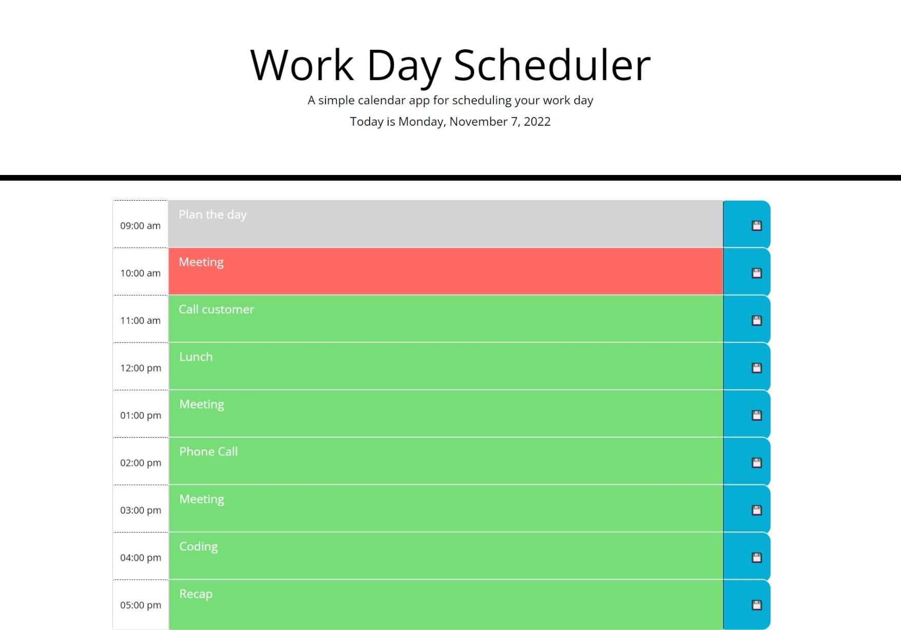

# byteSchedule

## Description

A work scheduler written in JQuery with bootstrap. Click on the text area and type. To save, click the blue button with save icon to the right of the text area that you want to save. Text areas will change color to indicate whether the time block is in the future(green), now(red), or past(gray). The time blocks are color coded to indicate whether it is in the past(gray), present(red), or future(green). The current day is displayed at the top of the calendar.

## Usage

[Link to deployed app](https://lesley-byte.github.io/byteSchedule/)

## Credits

Thank you to friends and family for their support. I also want to thank my tutor Sean New for his help and guidance. His git hub is [here](https://github.com/snew430).

## License

## Badges

## Tests

No tests are available at this time.
